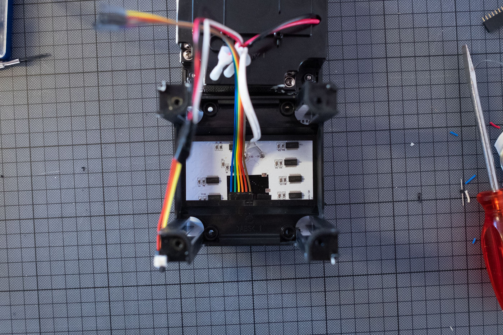

# frekvensHack

## Open the case

Open the four screws on the back.

Pry open back plate. It is glued, so it might take some light force.

Remove the four little corner spacers of the inner frame, each holding two screw nuts in place.

Remove the 8 screw nuts, too.

The inner frame is held in place by four screws. Open the screws and force the frame out of the case. Once the glue is broken, it should slide up.

There are two horizontal bars sitting under the frame, each holding four more srew nuts. Two of these nuts are visible – remove them. Then take out the bars. Leave the other two nuts in place (as seen on the pictures).

Remove the green PCB from the mainboard.

The red, black and white wires are for the buttons. Cut them from the PCB.

## Rewire

There are six connections on the main board. From left to right:

Pin | What it carries | Connect to Teensy
--- | --- | ---
Pin 1 | GND | Connect to Teensy GND
Pin 2 | LATCH | Connect to Teensy Pin 3
Pin 3 | CLOCK | Connect to Teensy Pin 2
Pin 4 | DATA | Connect to Teensy Pin 1
Pin 5 | ENABLE | Connect to Teensy Pin 0
Pin 6 | VCC | Connect to Teensy VIN

The VCC connection has 4 volts coming from the power supply, so it can be used to power the Teensy.

For the buttons:

Wire | What it carries | Connect to Teensy
--- | --- | ---
Red | Common | Connect to Teensy GND
Black | Red button | Connect to Teensy Pin 6
White | Yellow button | Connect to Teensy Pin 5

I've added a CV input to the Teensy, connected to A9.

## Make a cable hole

Open the four screws of the power supply. We don't need to open it completely, but just enough to get out the screw nut in the buttom right corner.

Cut out the plastic holding the screw, so there's a nice hole. Feed a USB cable and a patch cable through this hole.

Cut out a piece from the same corner of the inner frame, as well as from the corner spacer. Feed the cables through it and place it into position.

Connect the USB cable to the Teensy, and the patch cable into the jack.

## Reassemble

To reassemble the whole cube, start be placing the mainboard on top of the LEDs, then the horizontal bars, then the inner frame on top of the mainboard and the bars. 
Note the orientation of each part:
- The outer case has a little tip and the mainboard has a corresponding cutout.
- Position so that tip and cutout are on the right side. "DC-" and "DC+" on the mainboard will read upside down, "HE-YINYUEPINLED-A3" will read top to bottom.
- Position the frame, so it reads ">ABS< 1" horizontally. 

Now push everything into the outer case. Then lift the inner frame again and place two screw nuts inside on the left and right side of each horizontal bar. Once in place, push everything back into the frame. Then add the 8 screw nuts and corner spacers into the corners of the inner frame. Finally, place the power supply part with the back panel on top. Screw down.

