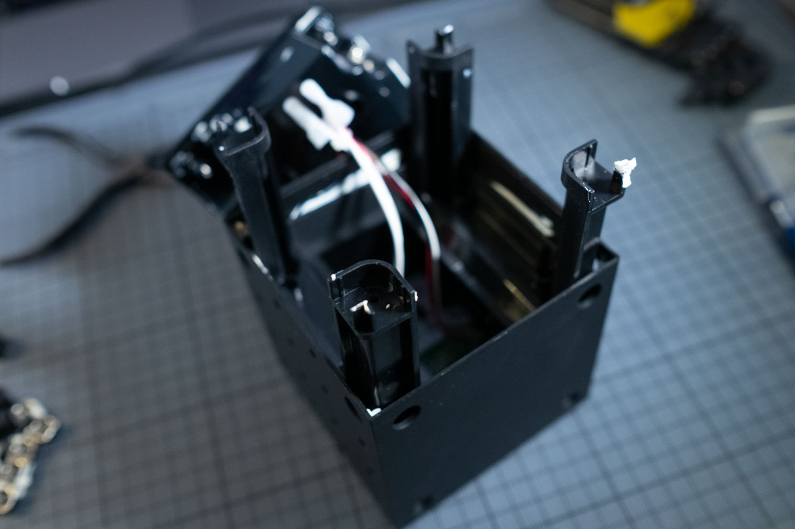

# frekvensHack

## Build Guide

### Open the case

Open the four screws on the back.

Pry open back plate. It is glued, so it might take some light force.

Remove the four little corner parts of the inner frame, each holding two screw nuts in place.

Remove the 8 screw nuts, too.

The inner frame is held in place by four screws. Open the screws and force the frame out of the case. Once the glue is broken, it should slide up.

There are two horizontal bars sitting under the frame, each holding four more srew nuts. Two of these nuts are visible – remove them. Then take out the bars.

The main board has a green PCB soldered to it. Unsolder the green PCB.

The red, black and white wires are for the buttons. Cut them from PCB.

